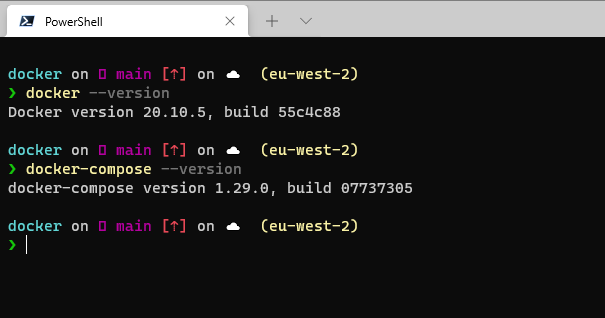

# How to Install Docker

## Windows

Other than some version [requirements](https://docs.microsoft.com/en-us/windows/wsl/install-win10#step-2---check-requirements-for-running-wsl-2) for WSL2, installing Docker on Windows is as simple as:

1. Install WSL2 on Windows 10 using the [official WSL documentation](https://docs.microsoft.com/en-us/windows/wsl/install-win10)
2. Install [Docker Desktop](https://www.docker.com/products/docker-desktop)

Verify the install with `docker --version` and `docker-compose --version`

